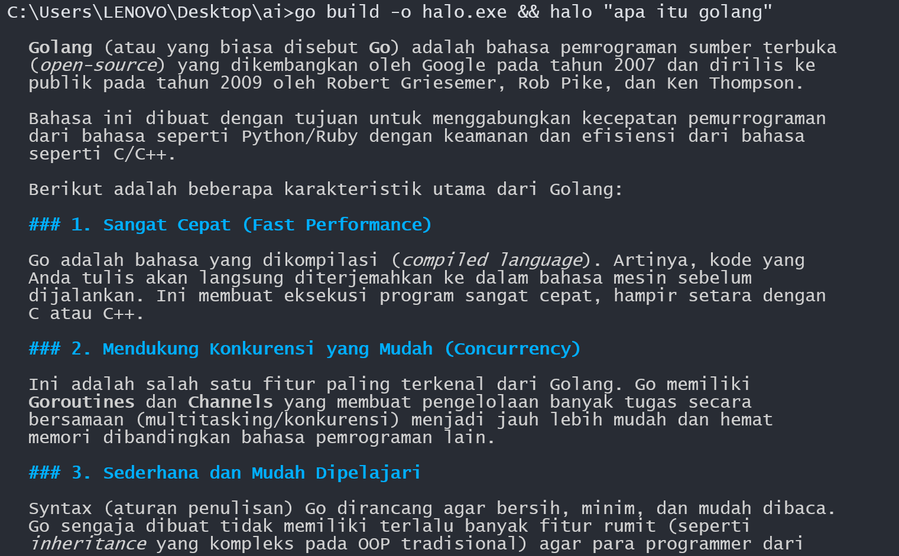
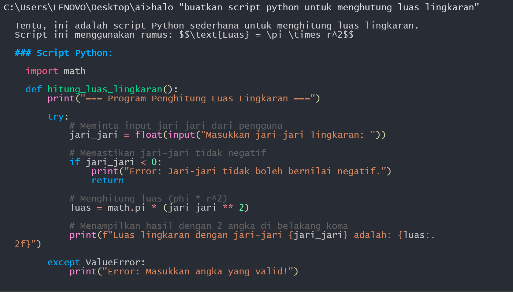

# Halo 


"Halo" is a simple and fast CLI-based AI chat, and fully supports the Gemini AI ecosystem. Written in Go.

**English version** [here](README-EN.md)

## Philosophy
The philosophy of "Halo" itself is simplicity.
- no complicated configuration.
- no cost whatsoever.
- no complex flags that need to be memorized or learned first.
- just paste your Gemini API key and use "Halo" as you like ❤️.

## Quick Installation
```bash
git clone https://github.com/im-Like-Satay/Halo-cli
cd Halo-cli 
go mod tidy

# Windows
go build -o halo.exe .

# Linux / macOS
go build -o halo .

# Set API Key 
halo set <apikey>
```

## Usage
```bash
halo "apa itu golang"
```

## Screenshot



## TODO
[✅] easier configuration.
[ ] easier installation.

## License
MIT
